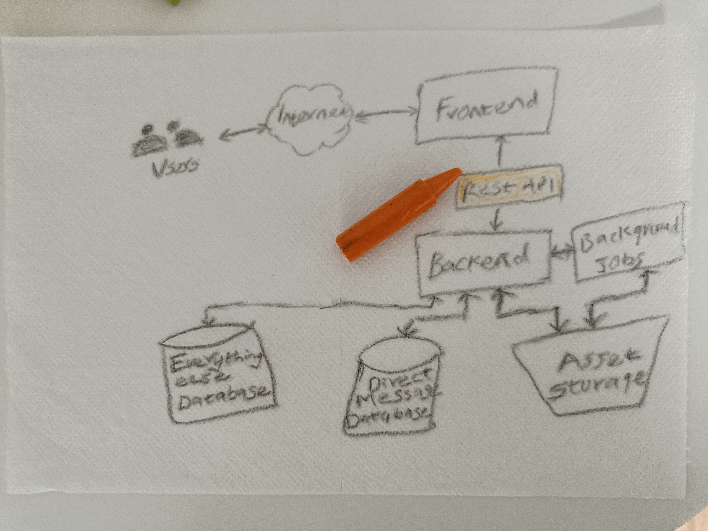
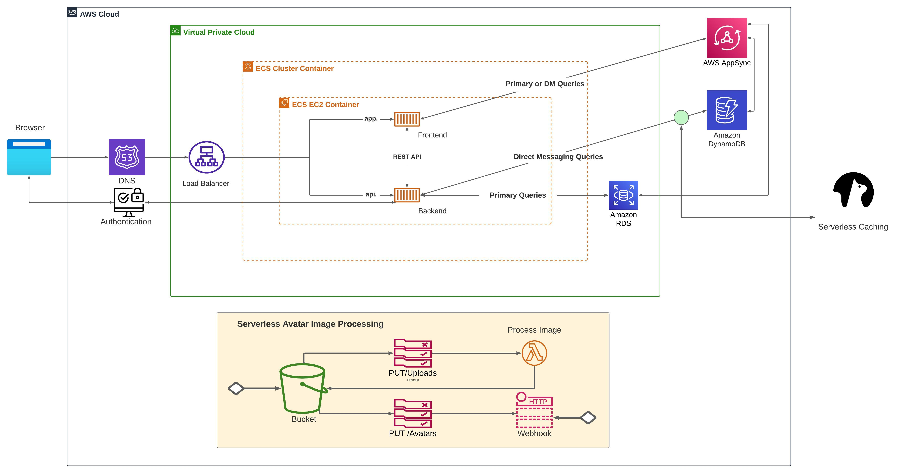
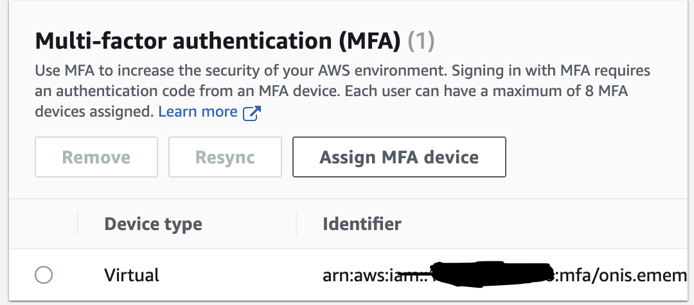
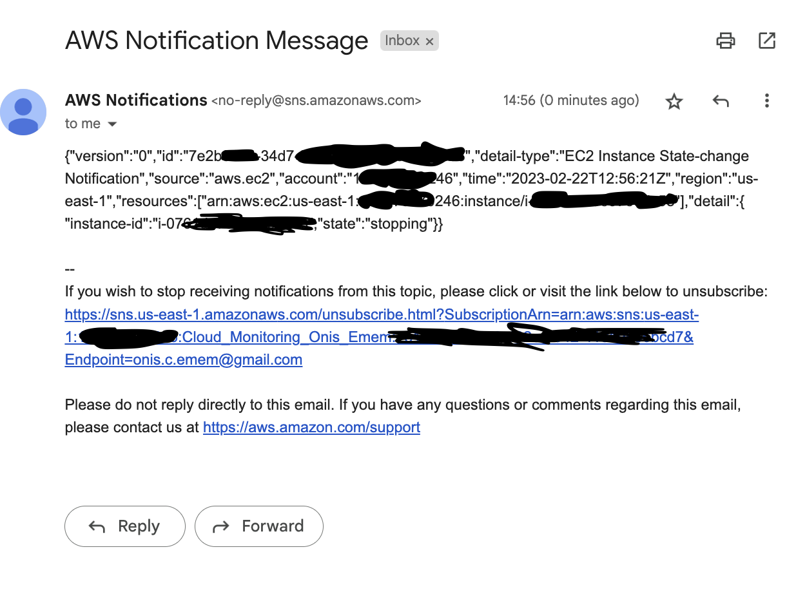
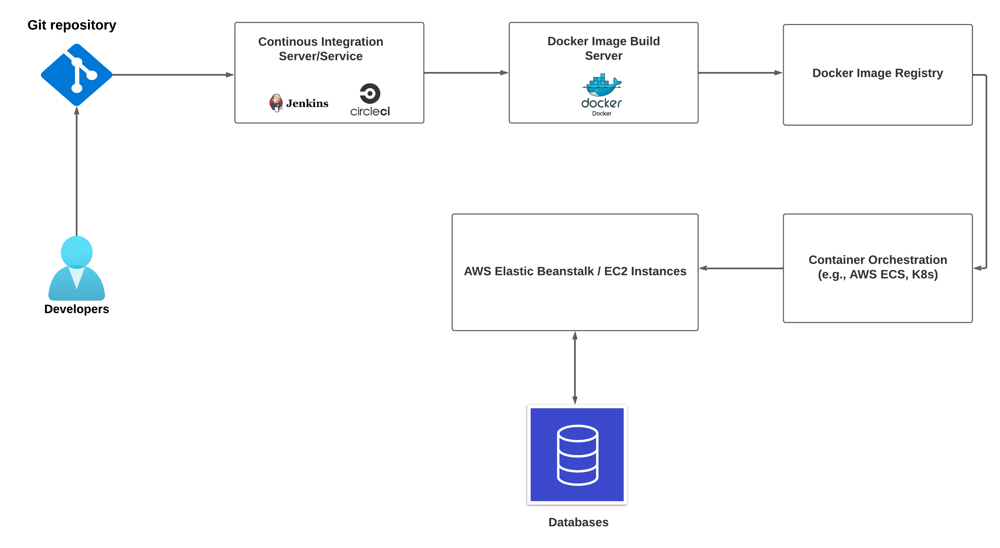
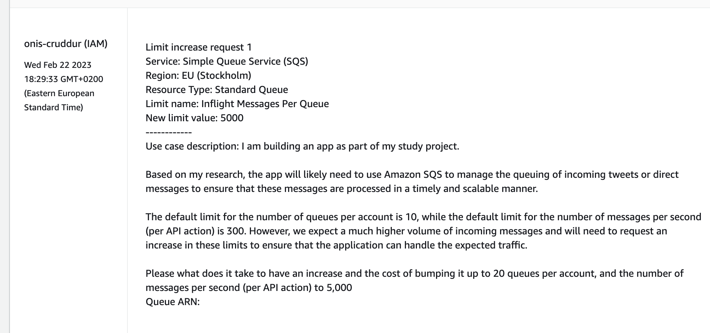

# Week 0 — Billing and Architecture

## Architecture

I literally used my daughter's crayon to make my conceptual napkin design for Cruddur app:

Click [here](https://lucid.app/lucidchart/5d65d5d7-b7ed-479e-ac3e-f44ac13a232e/edit?viewport_loc=-104%2C-1027%2C3811%2C2334%2C0_0&invitationId=inv_36150863-8a4a-459e-9f4f-609d6650db02) to see the digital conceptual diagram on lucid.

## Overview

As a cloud engineering enthusiast, I find the value of a logic diagram and conceptual napkin design to be invaluable when working with various stakeholders on a project. These diagrams help to provide a clear visual representation of the architecture, which makes it easier for everyone to understand the system, irrespective of their background (technical/non-technical).

For the logic/conceptual diagram, I map out the various components, including the frontend, backend, databases, and common services. This allows me to see the big picture and identify any potential areas for improvement.

Using the logic diagram in this project journal helps with communication and collaboration among the team. By providing a clear and visual representation of the system.

### Cruddur logical design

This was produced using Lucid chart.

[Here is a link ](https://lucid.app/lucidchart/5d65d5d7-b7ed-479e-ac3e-f44ac13a232e/edit?viewport_loc=-2554%2C-956%2C5467%2C3348%2Cz_TwYiyfCX7p&invitationId=inv_36150863-8a4a-459e-9f4f-609d6650db02) to this design on Lucid chart.

## Week-0 Challenge

### 1. Destroy your root account credentials, Set MFA, IAM role

IAM Role and MFA was up successfully

### 2. Use EventBridge to hookup Health Dashboard to SNS and send notification when there is a service health issue.

**EventBridge was setup successfully**

The steps included:

- Create an SNS topic

- Create an EventBridge rule - Go to the EventBridge console and create a new rule. Configure the rule to match the Health Dashboard event pattern.

- Configure the rule to send events to the SNS topic.

- Subscribe to the SNS topic to receive notifications.

- Test the rule by creating a test event. For testing I shut down the EC2 instance I created and below is the notification I received.

### 3. Review all the questions of each pillars in the Well Architected Tool (No specialized lens)

The Well-Architected Framework is organized around five pillars:

#### Operational Excellence:

This pillar focuses on running and monitoring systems to deliver business value, and continually improving processes and procedures. The questions cover topics such as defining and managing processes, managing and automating changes, monitoring and responding to events, and optimizing resources.

#### Security:

The security pillar covers the best practices for securing your workloads and protecting your data. The questions cover topics such as implementing access controls, protecting data at rest and in transit, managing identities and access, and preparing for security events.

#### Reliability:

This pillar covers the best practices for ensuring that your workloads operate consistently and predictably, and can recover from failures. The questions cover topics such as managing change, automating recovery, testing recovery procedures, and managing the availability of resources.

#### Performance Efficiency:

The performance efficiency pillar covers the best practices for optimizing the performance and efficiency of your workloads. The questions cover topics such as selecting the right resource types, monitoring and improving performance, and using automation to optimize resources.

#### Cost Optimization:

The cost optimization pillar covers the best practices for optimizing your costs and maximizing the value of your investment in the cloud. The questions cover topics such as managing and optimizing costs, selecting the right pricing models, and analyzing usage and cost data.

### 4. Create an architectural diagram (to the best of your ability) the CI/CD logical pipeline in Lucid Charts

[Here is a link ](https://lucid.app/lucidchart/5d65d5d7-b7ed-479e-ac3e-f44ac13a232e/edit?viewport_loc=-1009%2C-158%2C3997%2C2338%2CVuzzWLObp0GK&invitationId=inv_36150863-8a4a-459e-9f4f-609d6650db02) to this design on Lucid chart.

### 5. Research the technical and service limits of specific services and how they could impact the technical path for technical flexibility.

Here is an overview of key AWS services I researched, their technical and service limits.

| AWS Service       | Technical Limits                                                                                 | Service Limits                                                                                                                |
| ----------------- | ------------------------------------------------------------------------------------------------ | ----------------------------------------------------------------------------------------------------------------------------- |
| Amazon EC2        | Up to 768 vCPUs and 25 Gbps network bandwidth per instance. Up to 16 TiB storage per EBS volume. | Default limit of 20 On-Demand instances per region, with the ability to request an increase.                                  |
| Amazon S3         | Up to 5 TB per object, unlimited number of objects per bucket.                                   | Up to 3,500 PUT/COPY/POST/DELETE and 5,500 GET/HEAD requests per second per prefix in a bucket.                               |
| AWS Lambda        | Up to 10 GB memory and 900 seconds (15 minutes) execution time per invocation.                   | Default limit of 1,000 concurrent executions per region, with the ability to request an increase.                             |
| Amazon RDS        | Up to 32 vCPUs and 244 GiB RAM per database instance. Up to 64 TiB storage per database.         | Default limit of 40 DB instances per account, with the ability to request an increase.                                        |
| Amazon DynamoDB   | Up to 10 GB per partition, with automatic partitioning.                                          | Up to 40,000 read capacity units (RCUs) and 40,000 write capacity units (WCUs) per table.                                     |
| AWS EBS           | Up to 64 TiB per volume.                                                                         | Default limit of 500 volumes per account, with the ability to request an increase.                                            |
| Amazon VPC        | Up to 5,000 subnets and 5,000 security groups per VPC.                                           | Default limit of 5 VPCs per region, with the ability to request an increase.                                                  |
| Amazon SQS        | Up to 256 KB per message and 14 days message retention period.                                   | Up to 300 messages per second (per API action) and 10 queues per account by default, with the ability to request an increase. |
| Amazon CloudFront | Up to 1 PB cache size per distribution.                                                          | Default limit of 25 distributions per account, with the ability to request an increase.                                       |

### 6. Open a support ticket and request a service limit

Based on my research, Cruddur app will likely need to use Amazon SQS to manage the queuing of incoming tweets or direct messages to ensure that these messages are processed in a timely and scalable manner.

The default limit for the number of queues per account is 10, while the default limit for the number of messages per second (per API action) is 300. However we expect a much higher volume of incoming messages, and will need to request an increase to these limits to ensure that the application can handle the expected traffic.

